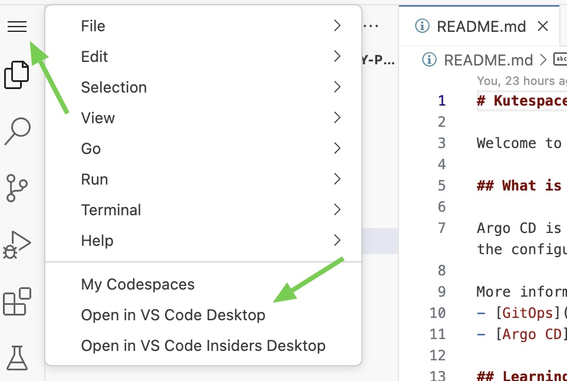

# Kutespace: Argo CD

Welcome to Kutespace's Argo CD development repository! This guide will help you contribute to Argo CD. It contains a fully preconfigured development environment that lets you get started in just a minute.

## Getting Started

To begin, [launch a new Codespace using the default settings.](https://codespaces.new/kutespaces/kubernetes)

Running this Codespace in the browser will not work. As soon as the code space is ready, launch it in your local VS Code Desktop.
To do so extend the menu in the left upper corner and select `Open in VS Code Desktop`. You can also configure VS Code Desktop as your default in [settings/codespaces](https://github.com/settings/codespaces).

To properly view the rendered README either view it in your browser or open the Command Palette (Ctrl+Shift+P) and select `Markdown: Open Preview`.

## What's next

* Read the guides:
  * [Contributors Quick-Start](https://argo-cd.readthedocs.io/en/latest/developer-guide/contributors-quickstart/)
  * [Development Toolchain Guide](https://argo-cd.readthedocs.io/en/latest/developer-guide/toolchain-guide/)
  * [E2E Tests](https://argo-cd.readthedocs.io/en/latest/developer-guide/test-e2e/)

## Troubleshooting

Encountering issues? Let us know to assist you and others who may face similar challenges.
